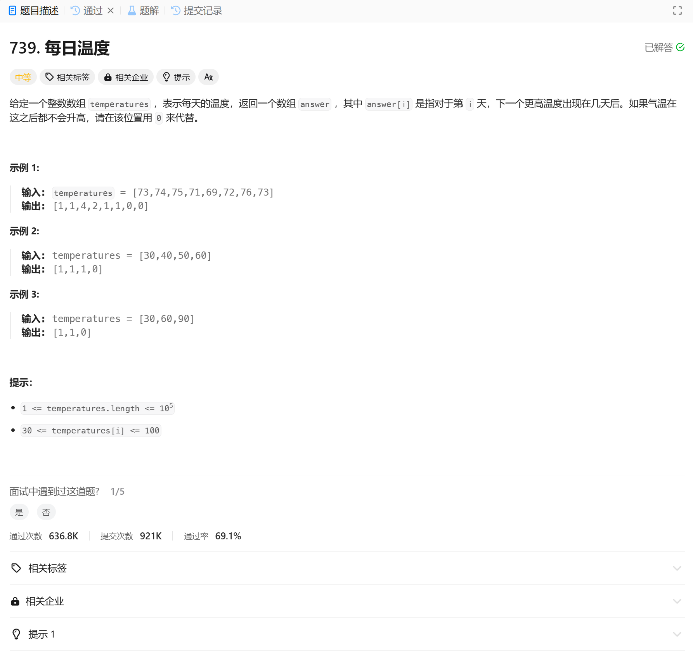

# 739. 每日温度
## 题目链接  
[739. 每日温度](https://leetcode.cn/problems/daily-temperatures/)
## 题目详情


***
## 解答一
答题者：EchoBai

### 题解
单调栈的思想

### 代码
``` cpp
class Solution {
public:
    vector<int> dailyTemperatures(vector<int>& temperatures) {
        std::stack<int> st;
        int size = temperatures.size();

        int cnt = 0;
        std::vector<int> res(size, 0);

        for(int i = 0; i < size; ++i){
            while(!st.empty() && temperatures[i] > temperatures[st.top()]){
                res[st.top()] = i - st.top();
                st.pop();
            }
            st.push(i);
        }

        return res;
    }
};
```


