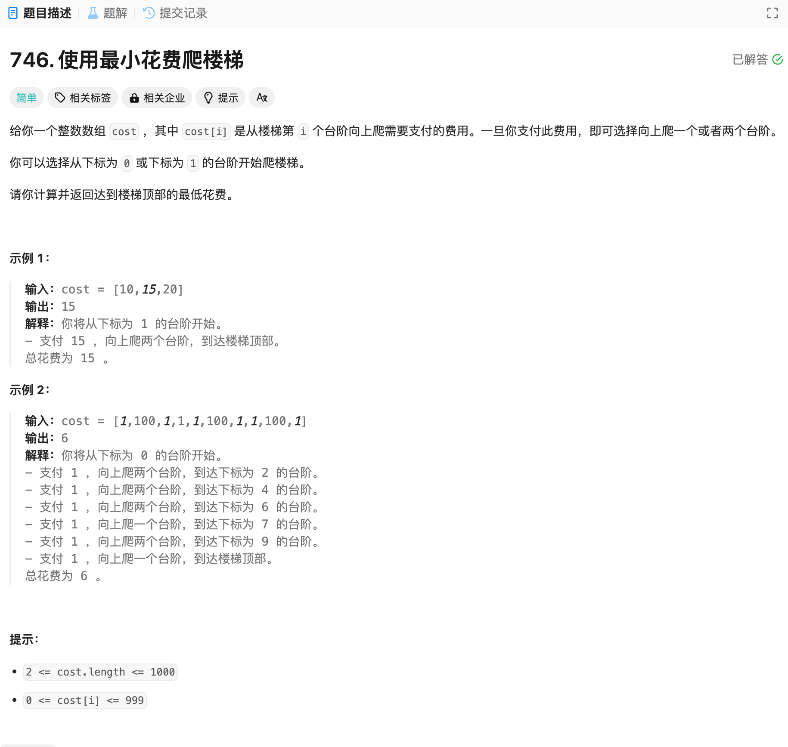

# 746. 使用最小花费爬楼梯
## 题目链接  
[746. 使用最小花费爬楼梯](https://leetcode.cn/problems/min-cost-climbing-stairs/description/)
## 题目详情


***
## 解答一
答题者：EchoBai

### 题解
根据定义递推即可。

### 代码
``` cpp
class Solution {
public:
    int minCostClimbingStairs(vector<int>& cost) {
        int size = cost.size();
        std::vector<int> dp(size + 1, 0);
        dp[0] = 0;
        dp[1] = 0;
        for(int i = 2; i <= size; ++i){
            int cost1 = dp[i-1] + cost[i-1];
            int cost2 = dp[i-2] + cost[i-2];
            dp[i] = std::min(cost1, cost2);
        }

        return dp[size];
    }
};
```


