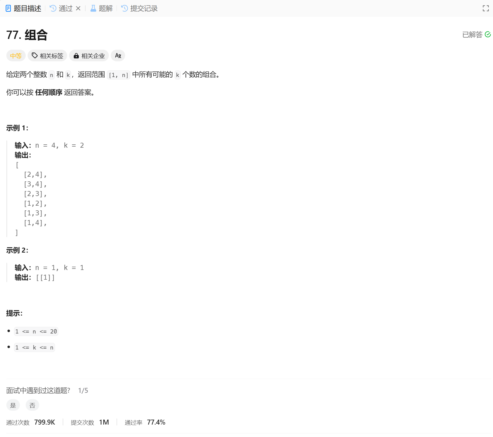

# 77. 组合
## 题目链接  
[77. 组合](https://leetcode.cn/problems/combinations/description/)
## 题目详情


***
## 解答一
答题者：EchoBai

### 题解
递归 + 回溯， 终止条件是满足所需元素个数。

### 代码
``` cpp
class Solution {
    std::vector<std::vector<int>> res;
    std::vector<int> comb;
public:
    vector<vector<int>> combine(int n, int k) {
        backtracking(n, k, 1);
        return res;
    }
    
    void backtracking(int n, int k, int startIdx){
        if(comb.size() == k){
            res.emplace_back(comb);
            return;
        }

        for(int i = startIdx; i <= n; ++i){
            comb.emplace_back(i);
            backtracking(n, k, i + 1);
            comb.pop_back();
        }
    }
};
```
