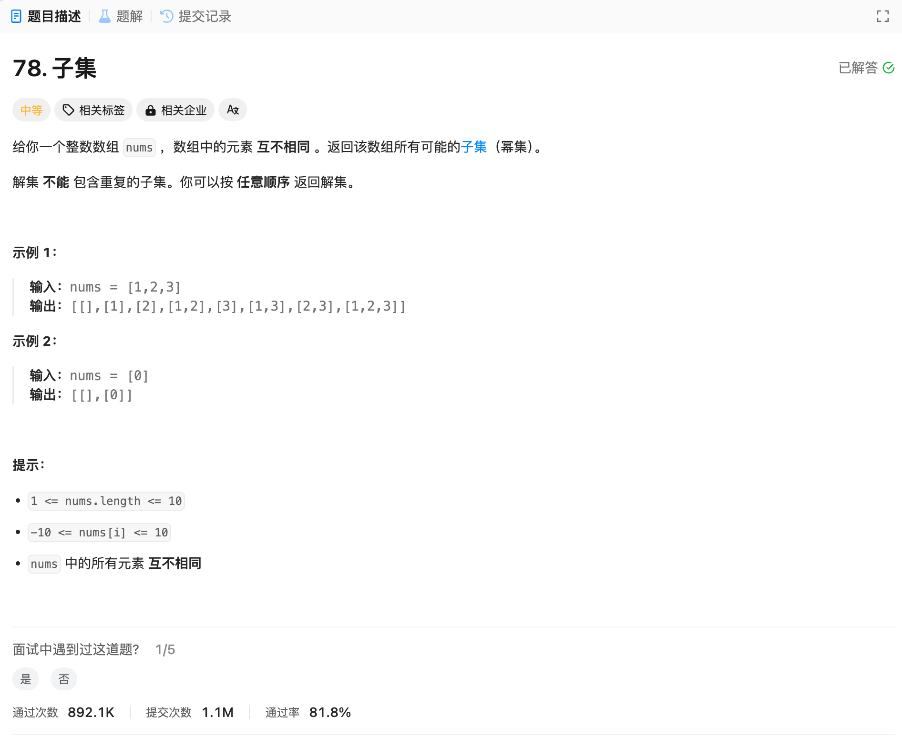

# 78. 子集
## 题目链接  
[78. 子集](https://leetcode.cn/problems/subsets/)
## 题目详情


***
## 解答一
答题者：EchoBai

### 题解
子集问题，回溯法。终止条件就是当前遍历位置以及到字符串末尾。只要子集中有元素就放入最终结果集。
### 代码
``` cpp
class Solution {
    vector<vector<int>> res;
    vector<int> sets;
public:
    vector<vector<int>> subsets(vector<int>& nums) {
        vector<int> nullset;
        res.push_back(nullset);
        backtracking(nums, 0);
        return res;
    }

    void backtracking(vector<int>& nums, int startIdx){
        if(sets.size() > 0){
            res.push_back(sets);
        }
        if(startIdx >= nums.size()){
            return;
        }
        for(int i = startIdx; i < nums.size(); ++i){
            sets.push_back(nums[i]);
            backtracking(nums, i + 1);
            sets.pop_back();
        }
    }
};
```
