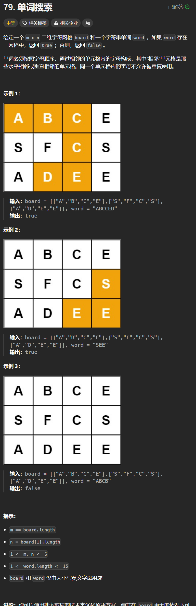

# 79. 单词搜索
## 题目链接  
[79. 单词搜索](https://leetcode.cn/problems/word-search/)
## 题目详情


***
## 解答一
答题者：**Yuiko630**

### 题解
>递归+回溯，主函数里尝试以每一个下标为起点开始递归，递归里先判断字符是否一致，长度是否达标，然后加入结果，标记使用，随后测试它的上下左右四个方向是否能继续，不能则回溯，标记不使用。

### 代码
``` Java
class Solution {
    StringBuilder res = new StringBuilder();
    int[][] move = {
        {-1, 0},
        {1, 0},
        {0, -1},
        {0, 1},
        
    };
    public boolean exist(char[][] board, String word) {
        int m = board.length, n = board[0].length;
        boolean[][] used = new boolean[m][n];
        for(int i = 0; i < m; i++){
            for(int j = 0 ; j < n; j++){
                if(backtrack(board,word, used, 0,i,j)) return true;
            }
        }
        return false;
    }
    public boolean backtrack(char[][] board, String word, boolean[][] used, int index, int x, int y){
        if(word.charAt(index) != board[x][y]) return false;
        if(index == word.length() - 1) return true;
        res.append(board[x][y]);
        used[x][y] = true;
        boolean result = false;
        for(int i = 0; i < 4; i++){
            // System.out.println(res.toString());
            int new_x = x+move[i][0];
            int new_y = y+move[i][1];
            if(new_x >= 0 && new_x < board.length && new_y >= 0 && new_y < board[0].length){
                if(used[new_x][new_y] == false){
                    boolean flag = backtrack(board, word, used, index+1, new_x, new_y);
                    if(flag) {
                        result = true;
                        break;
                    }
                }
            }
        }
        res.deleteCharAt(res.length() - 1);
        used[x][y] = false;
        return result;
    }
}
```
