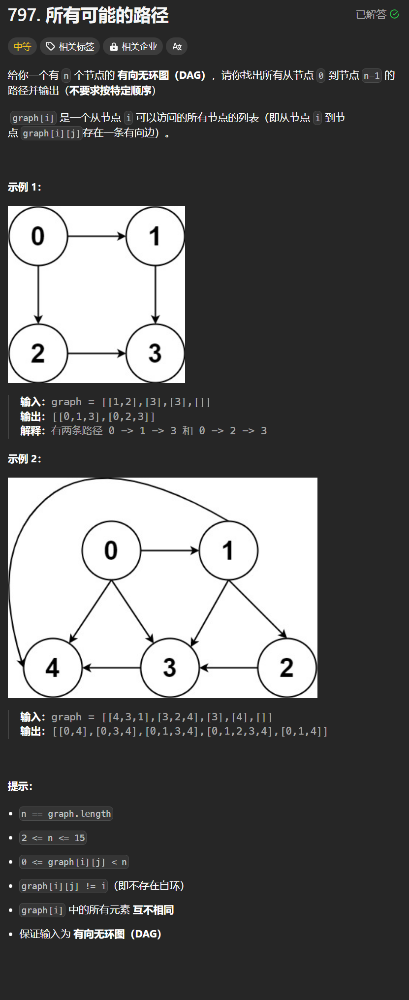

# 797. 所有可能的路径
## 题目链接  
[797. 所有可能的路径](https://leetcode.cn/problems/all-paths-from-source-to-target/description/)
## 题目详情


***
## 解答一
答题者：**Yuiko630**

### 题解
>DFS，递归+回溯

### 代码
``` Java
class Solution {
    List<List<Integer>> result = new ArrayList<>();
    List<Integer> path = new ArrayList<>();
    public void dfs(int[][] graph, int n, int node){
        if(node == n-1){
            result.add(new ArrayList(path));
            return;
        }
        for(int i = 0; i < graph[node].length; i++){
            int neighbor = graph[node][i];
            path.add(neighbor);
            dfs(graph, n, neighbor);
            path.removeLast();
        }
    }
    public List<List<Integer>> allPathsSourceTarget(int[][] graph) {
        int n = graph.length;
        path.add(0);
        dfs(graph, n, 0);
        return result;
    }
}
```