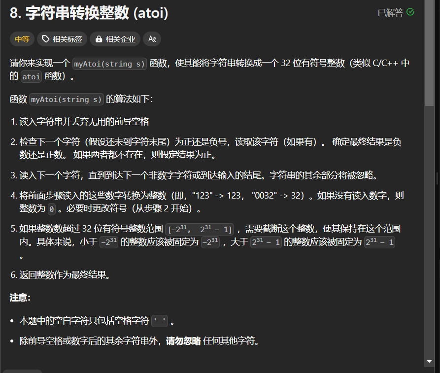

# 8. 字符串转换整数 (atoi)
## 题目链接  
[8. 字符串转换整数 (atoi)](https://leetcode.cn/problems/string-to-integer-atoi/)
## 题目详情


***
## 解答一
答题者：EchoBai

### 题解
根据题意，首先一个合法的输入应该是一堆空白符或者没有空格后面跟上一个符号位跟上一堆数字，我们先用循环滤掉空白符，然后判断下一位是`+`还是`-`，决定符号位，之后将每一位字符转化为数字，然后以此循环累加就能计算出最终结果，这里的难点主要是需要处理溢出的情况。
> 另此处其实也可先将每一位字符转为数字，然后将其存储到栈中，这样的好处是出栈的元素是从低位到高位，更符合直觉，但是不知道为什么这样计算会超出时间限制。哎~，代码见下，希望好心人能给出解答。

### 代码
``` cpp
class Solution {
public:
    int myAtoi(string s) {
        int flag = 1;
        int res = 0;
        int i = 0;
        int len = s.size();
        int e = 0;
        while( i < len && s[i] == ' ')
            i++;
        if(s[i] == '-'){
            flag = -1;
            i++;
        }else if(s[i] == '+') i++;

        if(s[i] < '0' || s[i] > '9' || i == len)
            return 0;
        for(int j = i; j < len; ++j){
            if(s[j] >= '0' && s[j] <= '9'){
                e = s[j] - '0';
                if(res > (INT_MAX - e)/10)
                    return INT_MAX;
                if(res < (INT_MIN + e)/10)
                    return INT_MIN;
                res *= 10;
                res += e * flag;
            }else {
                break;
            }
        }
        return res;
    }
};
```


