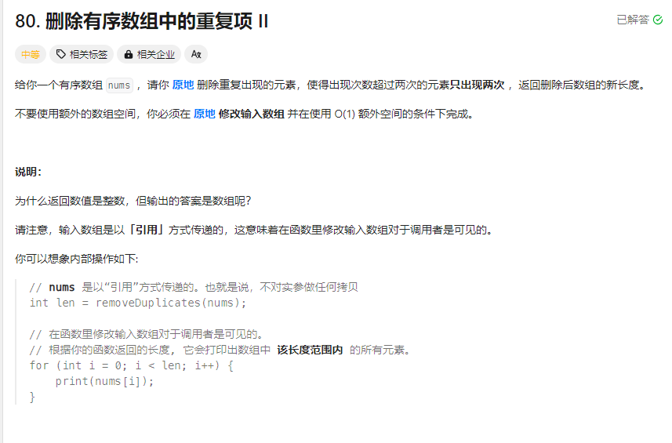

# 80. 删除有序数组中的重复项Ⅱ
## 题目链接  
[链接](https://leetcode.cn/problems/remove-duplicates-from-sorted-array-ii/?envType=study-plan-v2&envId=top-interview-150)
## 题目详情


***
## 解答一
答题者：** Curtis **
### 代码
``` cpp
class Solution {
public:
    int removeDuplicates(vector<int>& nums) {
        int sameCnt = 0;
        int curNum = -1;
        for(int i = 0;i<nums.size();++i){
            if(curNum!=nums[i]){
                curNum = nums[i];
                sameCnt = 0;
                continue;
            }
            ++sameCnt;
            if(sameCnt>=2){
                nums.erase(nums.begin()+i);
                --i;
            }
        }
        return nums.size();

    }
};
```

### 题解

>很简单，遇到多的删除就好，需要着重处理边界条件而已