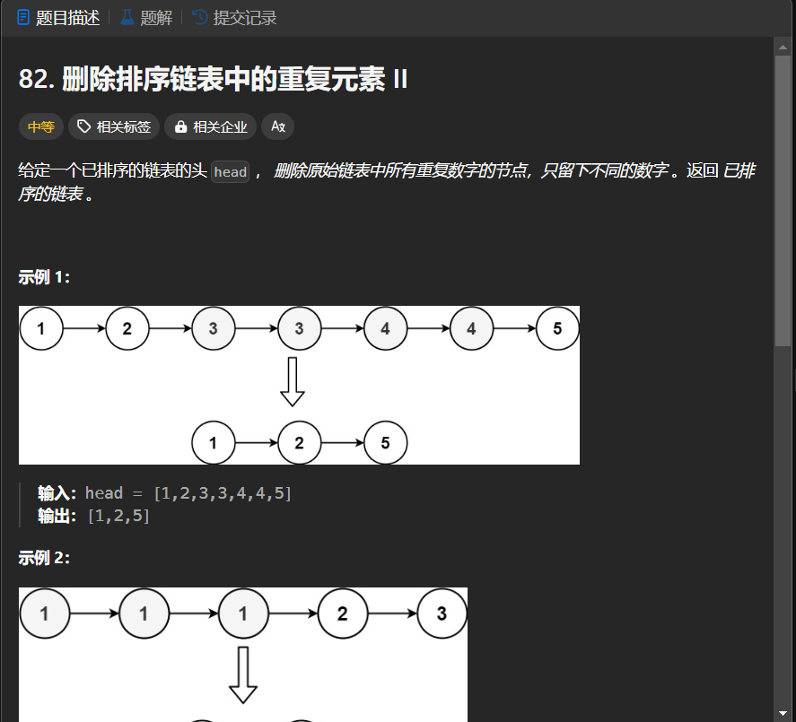

# 82. 删除排序链表中的重复元素 II
## 题目链接  
[82. 删除排序链表中的重复元素 II](https://leetcode.cn/problems/remove-duplicates-from-sorted-list-ii/description/)
## 题目详情


***
## 解答一
答题者：EchoBai

### 题解
用`map`建立一个`<val,ListNode*>`的键值对，如果是相同的`val`,那么就把值更新为最新的，这样达到去重的目的。但本题出了去重还需要把重复的给去除，因此我们在建立一个`<val,cnt>`的键值对，用于统计每个数字出现的次数，最后我们只保留出现次数为1的就行。需要注意的是我们最后是重建了整个链表，因此要去除链表间的关联信息。

### 代码
``` cpp
/**
 * Definition for singly-linked list.
 * struct ListNode {
 *     int val;
 *     ListNode *next;
 *     ListNode() : val(0), next(nullptr) {}
 *     ListNode(int x) : val(x), next(nullptr) {}
 *     ListNode(int x, ListNode *next) : val(x), next(next) {}
 * };
 */
class Solution {
public:
    ListNode* deleteDuplicates(ListNode* head) {
        if(!head) return head;
        ListNode* res = new ListNode(-1);
        ListNode* p = head;
        head = res;
        map<int,ListNode*> m1;
        map<int, int> m2;
        while(p){
            ++m2[p->val];
            m1[p->val] = p;
            p = p->next;
        }
        for(auto e : m1){
            cout << m2[e.first] << endl;
            if(m2[e.first] == 1){
                ListNode *t = e.second;
                t->next = nullptr;
                res->next = t;
                res = res->next;
            }
        }
        return head->next;
    }
};
```


