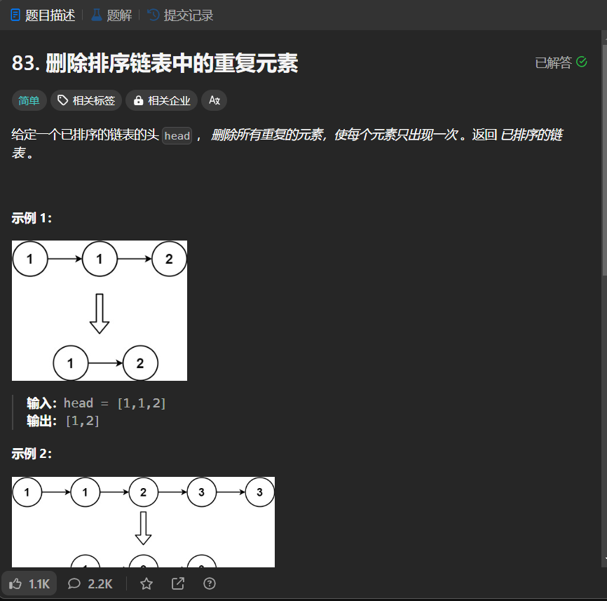

# 83. 删除排序链表中的重复元素
## 题目链接  
[83. 删除排序链表中的重复元素](https://leetcode.cn/problems/remove-duplicates-from-sorted-list/description/)
## 题目详情


***
## 解答一
答题者：EchoBai

### 题解
用`map`建立一个`<val,ListNode*>`的键值对，如果是相同的`val`,那么就把值更新为最新的，这样达到去重的目的。本来考虑用`set`来去重，但是发现链表虽然值相同，但是对应的节点值并不相同，故放弃。

### 代码
``` cpp
/**
 * Definition for singly-linked list.
 * struct ListNode {
 *     int val;
 *     ListNode *next;
 *     ListNode() : val(0), next(nullptr) {}
 *     ListNode(int x) : val(x), next(nullptr) {}
 *     ListNode(int x, ListNode *next) : val(x), next(next) {}
 * };
 */
class Solution {
public:
    ListNode* deleteDuplicates(ListNode* head) {
        ListNode* res = new ListNode(-1);
        ListNode* p = head;
        head = res;
        if(!head) return res;
        map<int, ListNode*> m;
        while(p){
            m[p->val] = p;
            p = p->next;
        }
        for(auto e : m){
            res->next = e.second;
            res = res->next;
        }
        return head->next;
    }
};
```


