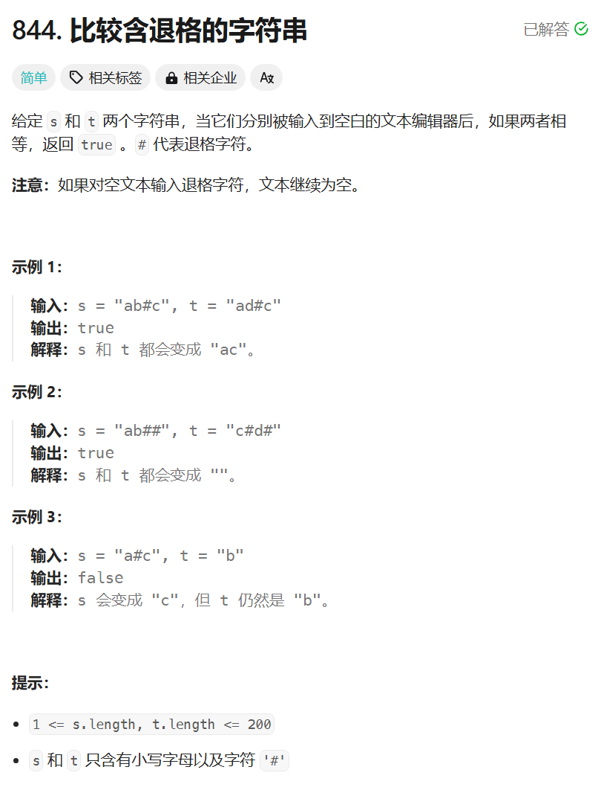

# 844. 比较含退格的字符串
## 题目链接  
[844. 比较含退格的字符串](https://leetcode.cn/problems/backspace-string-compare/description/)
## 题目详情


***
## 解答一
答题者：**Yuiko630**

### 题解
>双指针，。

### 代码
``` Java
class Solution {
    public boolean backspaceCompare(String s, String t) {
        String string_s = builder(s);
        String string_t = builder(t);
        return string_s.equals(string_t);
    }
    public String builder(String s){
        char[] chars = s.toCharArray();
        int slow = 0;
        int fast = 0;
        for(fast = 0; fast < chars.length; fast++){
            if(chars[fast] != '#'){
                char tmp = chars[fast];
                chars[fast] = chars[slow];
                chars[slow++] = tmp;
            }
            else{
                if(slow > 0) slow--;
            }
        }
        return new String(chars).substring(0, slow);
    }
}
```


