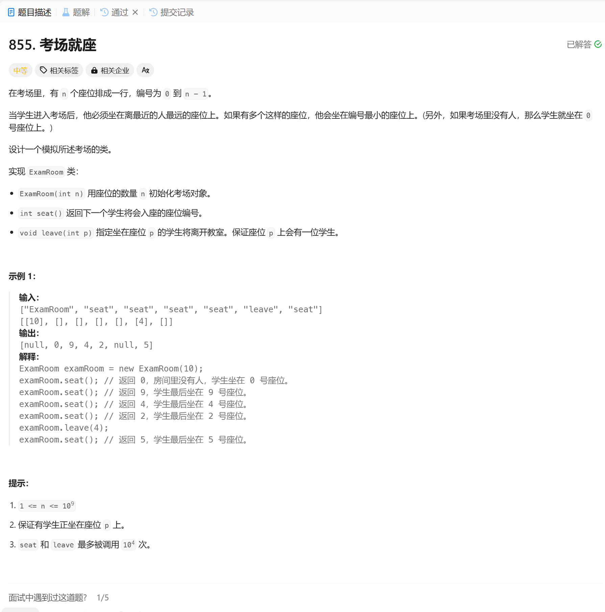

# 855. 考场就座
## 题目链接  
[855. 考场就座](https://leetcode.cn/problems/exam-room/description/?envType=daily-question&envId=2024-12-23)
## 题目详情


***
## 解答一
答题者：EchoBai

### 题解
使用一个set来记录当前被占用的座位，由于set内部自动维护有序，因此我们在找的时候直接从左到右遍历即可。因为题目要求距离最大加上尽量靠左，分析可知，每次有占座其实都将作为划分成不同的间隙，而每个间隙最佳插入点是间隙的中点，因此我们从左到右遍历，找出最大距离对应的插入位置即可。

### 代码
``` cpp
class ExamRoom {
private:
    std::set<int> rooms;
    int size;    
public:
    ExamRoom(int n): size(n){}
    
    int seat() {
        if(rooms.size() == 0){
            rooms.insert(0);
            return 0;
        }
        int l = -1, r = 0;
        int maxDis = 0, insertLoc = 0;
        if(*rooms.begin() != 0) maxDis = *rooms.begin();
        for(auto it = rooms.begin(); it != rooms.end(); ++it){
            r = *it;
            if(maxDis < (r - l) / 2){
                maxDis = (r - l) / 2;
                insertLoc = l + (r - l) / 2;
            }
            l = r;
        }

        if(r != size - 1){
            if(maxDis < size - 1 - r) insertLoc = size - 1;
        }
        rooms.insert(insertLoc);
        return insertLoc;
    }
    
    void leave(int p) {
        rooms.erase(p);
    }
};

/**
 * Your ExamRoom object will be instantiated and called as such:
 * ExamRoom* obj = new ExamRoom(n);
 * int param_1 = obj->seat();
 * obj->leave(p);
 */
```
