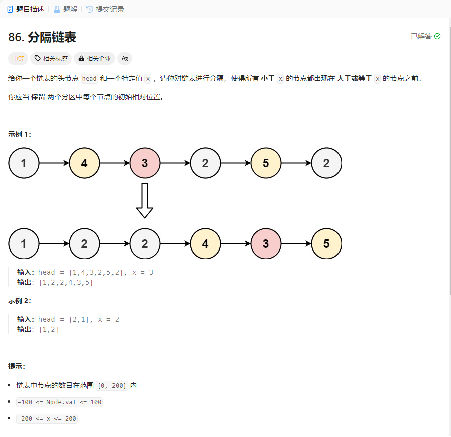

# 86. 分隔链表
## 题目链接  
[86. 分隔链表](https://leetcode.cn/problems/partition-list/description/)
## 题目详情


## 解答一
答题者：EchoBai

### 题解
用两个队列将小于`x`的和大于等于`x`的节点分别入队，然后重新组合成新的链表即可。

### 代码
``` cpp
/**
 * Definition for singly-linked list.
 * struct ListNode {
 *     int val;
 *     ListNode *next;
 *     ListNode() : val(0), next(nullptr) {}
 *     ListNode(int x) : val(x), next(nullptr) {}
 *     ListNode(int x, ListNode *next) : val(x), next(next) {}
 * };
 */
class Solution {
public:
    ListNode* partition(ListNode* head, int x) {
        ListNode* p = head;
        if(!head) return head;
        queue<ListNode*> small;
        queue<ListNode*> bigger;
        ListNode* res = new ListNode(-1);
        head = res;
        while(p){
            if(p->val < x)
                small.push(p);
            else 
                bigger.push(p);
            p = p->next;
        }
        while(!small.empty()){
            small.front()->next = nullptr;
            res->next = small.front();
            res = res->next;
            small.pop();
        }
        while(!bigger.empty()){
            bigger.front()->next = nullptr;
            res->next = bigger.front();
            res = res->next;
            bigger.pop();
        }
        return head->next;
    }
};
```


