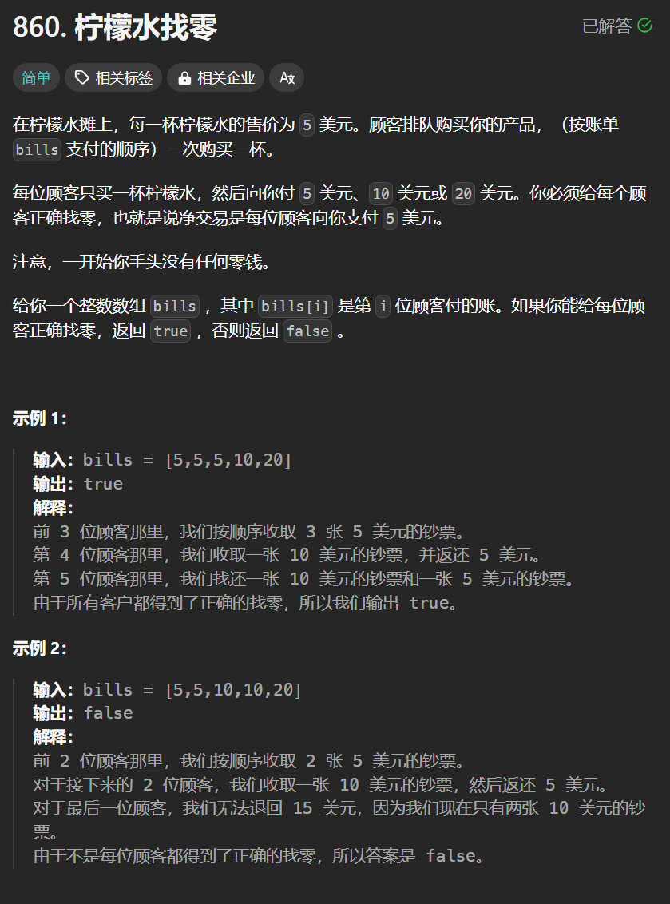

# 860. 柠檬水找零
## 题目链接  
[860. 柠檬水找零](https://leetcode.cn/problems/lemonade-change/description/)
## 题目详情


***
## 解答一
答题者：**Yuiko630**

### 题解
>贪心，因为顾客只会给5，10，20三种，局部最优，5元更万能，遇到账单20，优先消耗10和5，再判断有没有3个5。

### 代码
``` Java
class Solution {
    public boolean lemonadeChange(int[] bills) {
        int five = 0;
        int ten = 0;
        for(int i = 0; i < bills.length; i ++){
            if(bills[i] == 5){
                five++;
            }
            else if (bills[i] == 10){
                ten++;
                if(--five < 0) return false;
            }
            else{
                if(ten > 0 && five > 0){
                    ten -- ;
                    five --;
                }
                else if(five >= 3){
                    five -= 3;
                }
                else return false;
            }
        }
        return true;
    }
}
```