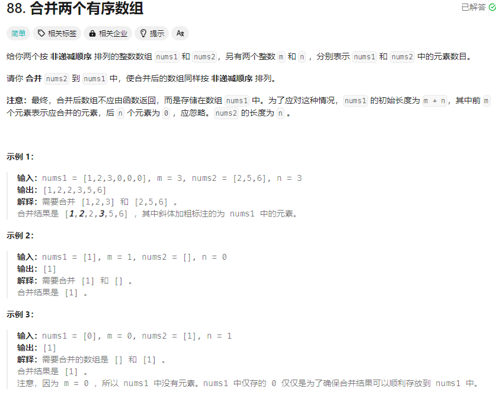

# 88. 合并两个有序数组
## 题目链接  
[88. 合并两个有序数组](https://leetcode.cn/problems/merge-sorted-array/?envType=study-plan-v2&envId=top-interview-150)
## 题目详情


***
## 解答一
答题者：**Curtis**
### 代码
``` cpp
class Solution {
public:
    void merge(vector<int>& nums1, int m, vector<int>& nums2, int n) {
        int n1Cnt =m-1;
        int n2Cnt =n-1;
        for (int i = n + m - 1; i >= 0; i--) {
            std::cout<<n2Cnt<<endl;
            if(n1Cnt==-1){
                nums1[i] = nums2[n2Cnt];
                --n2Cnt;
            }
            else if(n2Cnt==-1){
                nums1[i] = nums1[n1Cnt];
                --n1Cnt;
            }
            else if (nums1[n1Cnt] > nums2[n2Cnt]) {
                nums1[i] = nums1[n1Cnt];
                --n1Cnt;
            } 
            else {
                nums1[i] = nums2[n2Cnt];
                --n2Cnt;
            }
        }
    }
};
```

### 题解

>因为题目是用一个已有的数组来实现，将num2数组插入到num1数组并保持有序，固可以想到直接从后面进行插入排序，再处理一下边界条件即可


## 解答二
答题者：**Yuiko630**

### 题解
>用一个指针cur指向nums1的末尾放数，再用两个指针分别指向数组末尾，比较哪个大就把它插在cur。

### 代码
```Java
class Solution {
    public void merge(int[] nums1, int m, int[] nums2, int n) {
        int cur = nums1.length-1;
        int cnt1 = m;
        int cnt2 = n;
        while(cnt2 > 0){
            if(cnt1 > 0 && nums1[cnt1 - 1] > nums2[cnt2 - 1]){
                nums1[cur] = nums1[cnt1 - 1];
                cnt1--;
            }
            else{
                nums1[cur] = nums2[cnt2 - 1];
                cnt2--;
            }
            cur--;
        }
    }
}
```