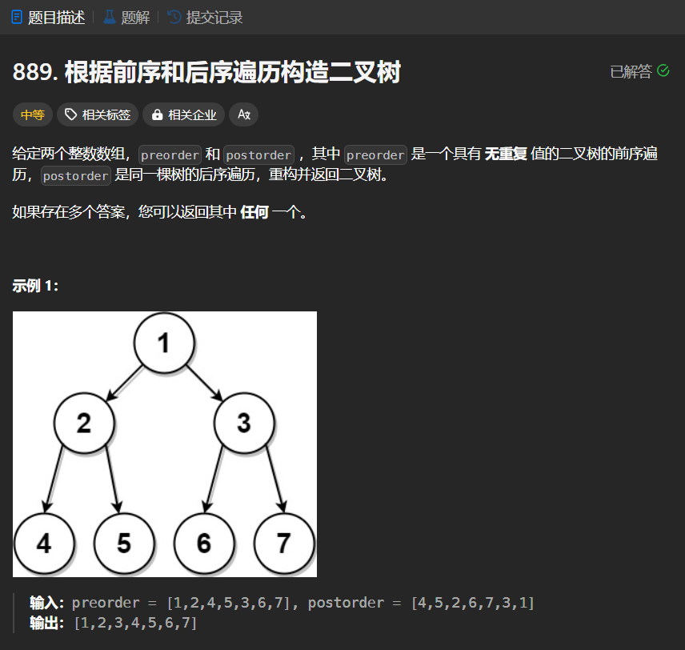

# 889. 根据前序和后序遍历构造二叉树
## 题目链接  
[889. 根据前序和后序遍历构造二叉树](https://leetcode.cn/problems/construct-binary-tree-from-preorder-and-postorder-traversal/description/?envType=daily-question&envId=2024-02-22)
## 题目详情


***
## 解答一
答题者：EchoBai

### 题解
从后序遍历倒数第二节点出发，可以将前序遍历划分为左右子树的前序遍历，然后根据前序序列中的左子树数量，可以划分左右子树后序序列，然后递归的建就行。

### 代码
``` cpp
/**
 * Definition for a binary tree node.
 * struct TreeNode {
 *     int val;
 *     TreeNode *left;
 *     TreeNode *right;
 *     TreeNode() : val(0), left(nullptr), right(nullptr) {}
 *     TreeNode(int x) : val(x), left(nullptr), right(nullptr) {}
 *     TreeNode(int x, TreeNode *left, TreeNode *right) : val(x), left(left), right(right) {}
 * };
 */
class Solution {
public:
    TreeNode* constructFromPrePost(vector<int>& preorder, vector<int>& postorder) {
        int n = preorder.size();
        if( n == 0) return nullptr;
        if( n == 1) return new TreeNode(preorder[0]);
        
        int index = 0;
        for(int i = 0; i < n; ++i){
            if(preorder[i] == postorder[n-2]){
                index = i;
                break;
            }
        }
        TreeNode* root = new TreeNode(preorder[0]);
        vector<int> l_preorder, r_preorder;
        for(int i = 1; i < index; ++i){
            l_preorder.push_back(preorder[i]);
        }
        for(int i = index; i < n; ++i ){
            r_preorder.push_back(preorder[i]);
        }
        vector<int> l_postorder, r_postorder;
        int left_cnt = l_preorder.size();
        for(int i = 0; i < left_cnt; ++i){
            l_postorder.push_back(postorder[i]);
        }
        for(int i = left_cnt; i < n; ++i){
            r_postorder.push_back(postorder[i]);
        }
        root->left = constructFromPrePost(l_preorder,l_postorder);
        root->right = constructFromPrePost(r_preorder,r_postorder);
        return root;
    }
};
```


