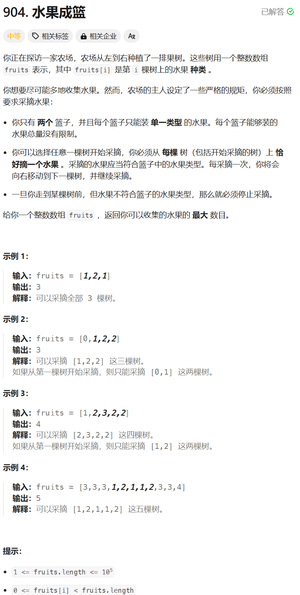

# 904. 水果成篮
## 题目链接  
[904. 水果成篮](https://leetcode.cn/problems/fruit-into-baskets/description/)
## 题目详情


***
## 解答一
答题者：**Yuiko630**

### 题解
>滑动窗口，窗口为只有2种类型且连续可采摘的水果树，当种类超过2种时窗口起始位置需要缩小，窗口终止位置为遍历索引。可以用一个map来记录窗口中水果类型及其对应的数量。

### 代码
``` Java
class Solution {
    public int totalFruit(int[] fruits) {
        int left = 0;
        int result = 0;
        int length = fruits.length;
        Map<Integer, Integer> count = new HashMap<Integer, Integer>();
        for (int right = 0; right < length; right++) {
            count.put(fruits[right], count.getOrDefault(fruits[right], 0) + 1);
            while (count.size() > 2) {
                count.put(fruits[left], count.get(fruits[left]) - 1);
                if (count.get(fruits[left]) == 0) {
                    count.remove(fruits[left]);
                }
                left++;
            }
            result = Math.max(result, right - left + 1);
        }
        return result;
    }
}
```


