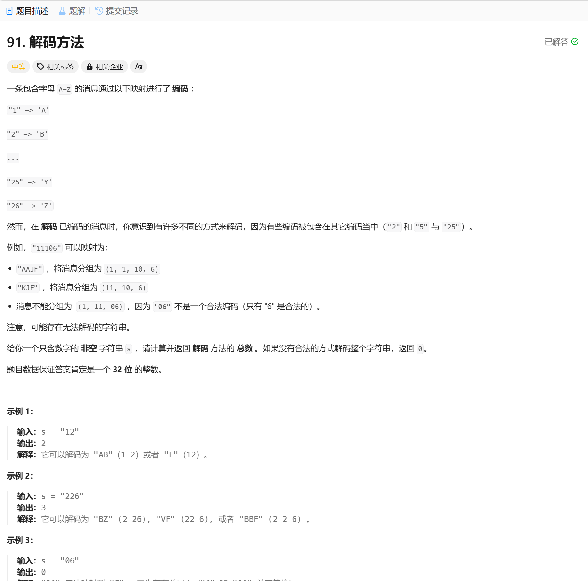

# 91. 解码方法
## 题目链接  
[91. 解码方法](https://leetcode.cn/problems/decode-ways/description/)
## 题目详情


***
## 解答一
答题者：**EchoBai**

## 题解
>动态规划，从前到后检查字符串，看看一个的解码种类，然后是两个字符的，依次向后累加种类即可。

### 代码
``` c++
class Solution {
public:
    int numDecodings(string s) {
        std::vector<int> dp(s.size() + 1, 0);
        dp[0] = 1; // null str has one decode way
        dp[1] = (s[0] != '0') ? 1 : 0; // single string has one decode way

        for (int i = 2; i <= s.size(); ++i) {
            // check one character
            if (s[i - 1] != '0') {
                dp[i] += dp[i - 1];
            }
            // check tow character
            if (s[i - 2] == '1' || (s[i - 2] == '2' && s[i - 1] <= '6')) {
                dp[i] += dp[i - 2];
            }
        }

        return dp[s.size()];
    }
};
```
