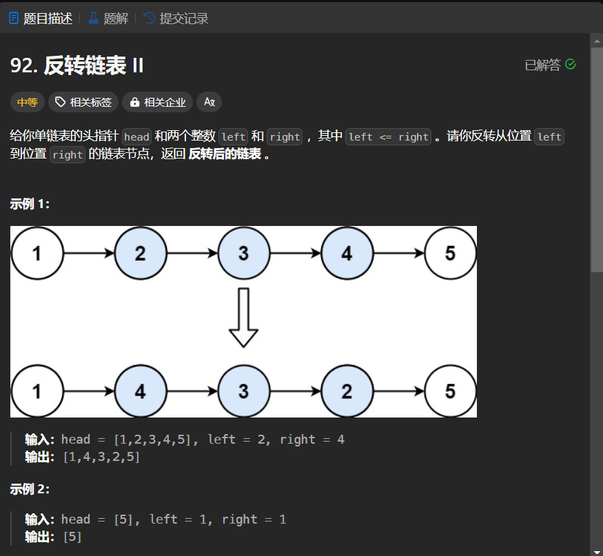

# 92. 反转链表 II
## 题目链接  
[92. 反转链表 II](https://leetcode.cn/problems/reverse-linked-list-ii/?envType=study-plan-v2&envId=top-interview-150)
## 题目详情


***
## 解答一
答题者：EchoBai

### 题解
使用栈将待反转的链表节点入栈，然后出栈重新组合即为逆序状态;

### 代码
``` cpp
/**
 * Definition for singly-linked list.
 * struct ListNode {
 *     int val;
 *     ListNode *next;
 *     ListNode() : val(0), next(nullptr) {}
 *     ListNode(int x) : val(x), next(nullptr) {}
 *     ListNode(int x, ListNode *next) : val(x), next(next) {}
 * };
 */
class Solution {
public:
    ListNode* reverseBetween(ListNode* head, int left, int right) {
        if(!head) return nullptr;
        if(!head->next) return head;
        int len = 1;
        ListNode* p = head;
        ListNode* res = new ListNode(-1);
        head = res;
        while(p && len < left){
            len++;
            res->next = p;
            res = res->next;
            p = p->next;
        }
        
        stack<ListNode*>s;
        int i = left;
        while(i <= right && p){
            s.push(p);
            ++i;
            p = p->next;
        }
        while(!s.empty()){
            ListNode* e = s.top();
            e->next = nullptr;
            res->next = e;
            res = res->next;
            s.pop();
        }
        res->next = p;
        return head->next;
    }
};
```


