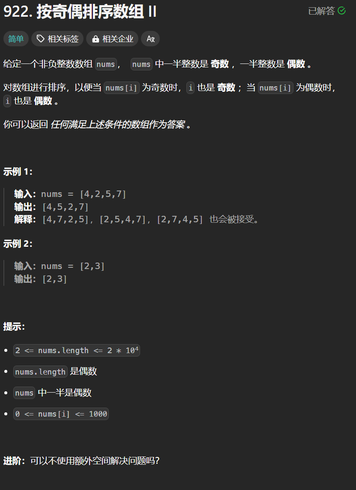

# 922. 按奇偶排序数组
## 题目链接  
[922. 按奇偶排序数组](https://leetcode.cn/problems/sort-array-by-parity-ii/description/)
## 题目详情


***
## 解答一
答题者：**Yuiko630**

### 题解
>双指针，left在偶数位上，如果遇到非偶数，则去跟奇数位right上偶数的交换。

### 代码
``` Java
class Solution {
    public int[] sortArrayByParityII(int[] nums) {
        int left = 0, right = 1;
        while(left < nums.length){
            if(nums[left] %2 == 0){
                left+=2;
                continue;
            }
            else{
                while(nums[right] % 2 == 1) right += 2;
                int temp = nums[left];
                nums[left] = nums[right];
                nums[right] = temp;
                left += 2;
            }
        }
        return nums;
    }
}
```