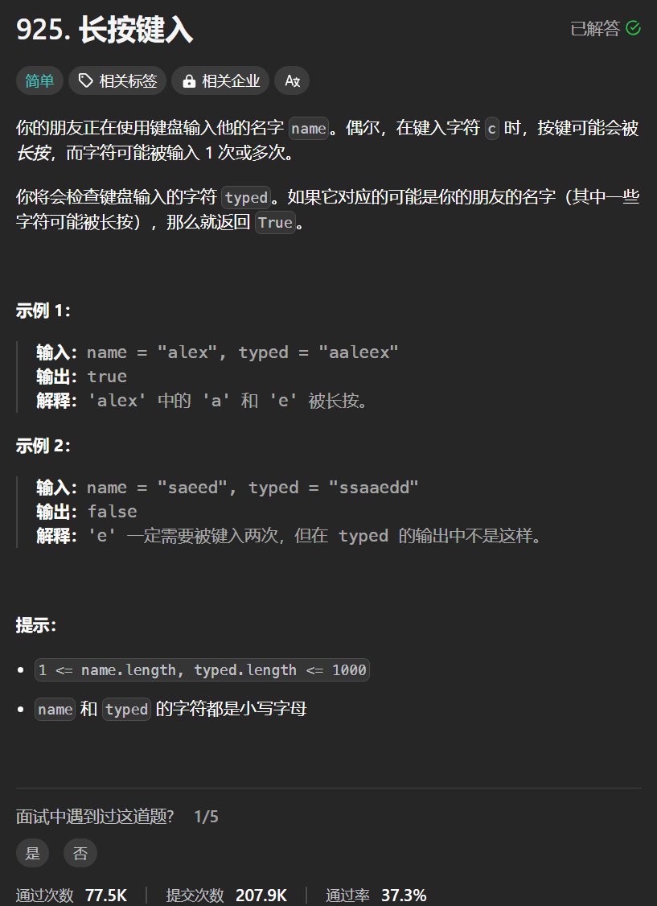

# 925. 长按键入
## 题目链接  
[925. 长按键入](https://leetcode.cn/problems/long-pressed-name/description/)
## 题目详情


***
## 解答一
答题者：**Yuiko630**

### 题解
>双指针，left在name上待匹配，right在typed上待匹配，遇到不一致的判断是否重复跳过后再判断。

### 代码
``` Java
class Solution {
    public boolean isLongPressedName(String name, String typed) {
        int left = 0, right = 0;
        char[] name1 = name.toCharArray();
        char[] typed1 = typed.toCharArray();
        while(left < name1.length && right < typed1.length){
            if(left == 0 && name1[left] != typed1[right]) return false;
            else if(name1[left] == typed1[right]){
                left ++;
                right ++;
            }
            else {
                while(right < typed1.length && name1[left] != typed1[right] && typed1[right-1] == typed1[right]){
                    right++;
                }
                if(right < typed1.length && name1[left] != typed1[right]) return false;
            }
        }
        if(left < name1.length) return false;
        while(right < typed1.length){
            if(typed1[right] != typed1[right-1]) return false;
            else right++;
        }
        return true;
    }
}
```