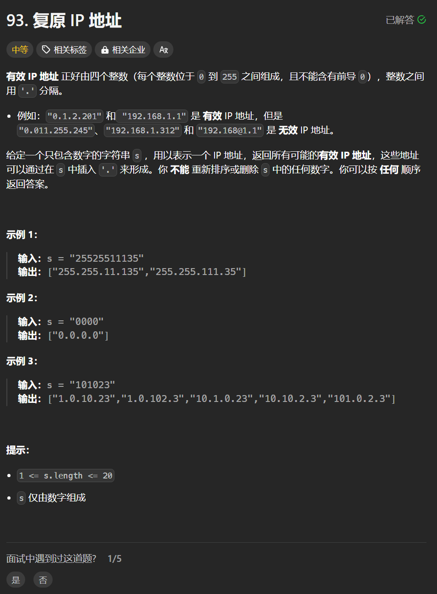

# 93. 复原IP地址
## 题目链接  
[93. 复原IP地址](https://leetcode.cn/problems/restore-ip-addresses/)
## 题目详情


***
## 解答一
答题者：**Yuiko630**

### 题解
>递归+回溯，用arraylist来保存临时结果，终止条件，已分割三段且最后一段合法则加入结果集，否则for循环遍历找下一个分割线。

### 代码
``` Java
class Solution {
    List<String> result = new ArrayList<>();
    List<String> res = new ArrayList<>();

    public List<String> restoreIpAddresses(String s) {
        backtracking(s, 0);
        return result;
    }

    public void backtracking(String s, int start) {
        if (res.size() == 3) {
            if (isVaild(s, start, s.length() - 1)) {
                String tmp = "";
                for (int i = 0; i < 3; i++) {
                    tmp = tmp + res.get(i) + ".";
                }
                tmp = tmp + s.substring(start, s.length());
                result.add(new String(tmp));
            }
            return;
        }
        for (int i = start; i < s.length(); i++) {
            if (isVaild(s, start, i)) {
                res.add(s.substring(start, i + 1));
                backtracking(s, i + 1);
                res.removeLast();
            } else
                break;
        }
    }

    public boolean isVaild(String s, int start, int end) {
        if (start > end || end - start > 3)
            return false;
        if (s.charAt(start) == '0' && start != end)
            return false;
        int num = 0;
        for (int i = start; i <= end; i++) {
            num = num * 10 + (s.charAt(i) - '0');
        }
        if (num > 255)
            return false;
        return true;
    }
}
```