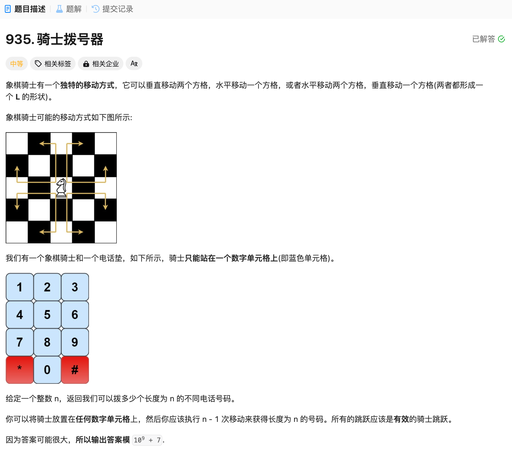

# 935. 骑士拨号器
## 题目链接  
[935. 骑士拨号器](https://leetcode.cn/problems/knight-dialer/description/?envType=daily-question&envId=2024-12-10)
## 题目详情


***
## 解答一
答题者：EchoBai

### 题解
枚举从每个位置出发能到达的数字序列NEXT，骑士在格子loc移动step步，其实等价于骑士step-1步能移动到的格子loc‘，另外由于在递归过程中可能存在很多相似的loc,step，那么为了避免重复开销，可以用一个记忆数组把它存储起来。

### 代码
``` cpp
class Solution {
    const int MOD = 1'000'000'007;
    const vector<int> NEXT[10] = {{4, 6}, {6, 8}, {7, 9}, {4, 8}, {0, 3, 9}, {}, {0, 1, 7}, {2, 6}, {1, 3}, {2, 4}};
    int memo[5000][10];

    int dfs(int step, int loc){
        if(step == 0){
            return 1;
        }
        int& res = memo[step][loc];
        if(res){
            return res;
        }

        for(int k: NEXT[loc]){
            res = (res + dfs(step - 1, k)) % MOD;
        }
        return res;
    }
public:
    int knightDialer(int n) {
        if(n == 1) return 10;
        long long ans = 0;
        for(int i = 0; i < 10; ++i){
            ans += dfs(n - 1, i);
        }
        return ans % MOD;
    }
};
```
