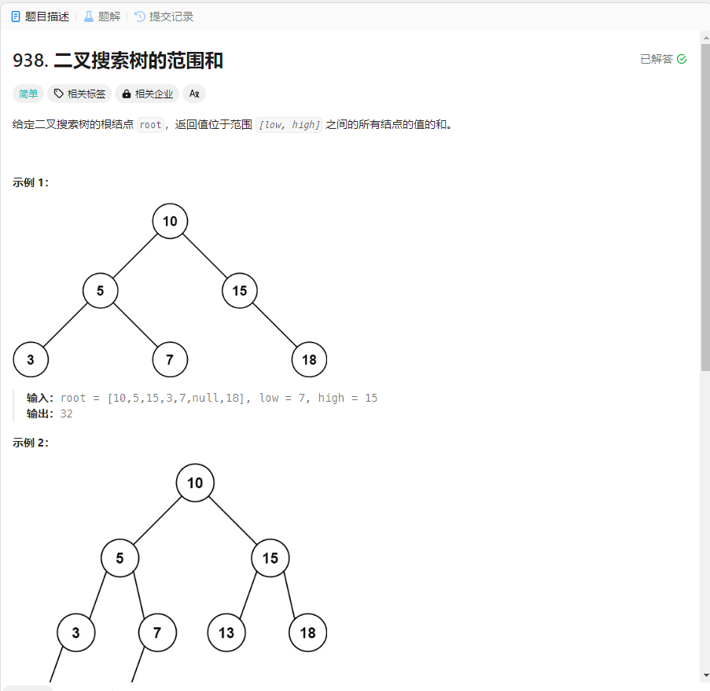

# 938. 二叉搜索树的范围和
## 题目链接  
[938. 二叉搜索树的范围和](https://leetcode.cn/problems/range-sum-of-bst/description/)
## 题目详情


## 解答一
答题者：EchoBai

### 题解
递归判断范围，在范围内加入即可。

### 代码
``` cpp
/**
 * Definition for a binary tree node.
 * struct TreeNode {
 *     int val;
 *     TreeNode *left;
 *     TreeNode *right;
 *     TreeNode() : val(0), left(nullptr), right(nullptr) {}
 *     TreeNode(int x) : val(x), left(nullptr), right(nullptr) {}
 *     TreeNode(int x, TreeNode *left, TreeNode *right) : val(x), left(left), right(right) {}
 * };
 */
class Solution {
public:
    int rangeSumBST(TreeNode* root, int low, int high) {
        int res = 0;
        travelAndCompute(root,res,low,high);
        return res;

    }
    void travelAndCompute(TreeNode* root, int &res,int low,int high){
        if(!root) return;
        if(root->val >= low && root->val <= high)
            res += root->val;
        travelAndCompute(root->left,res,low,high);
        travelAndCompute(root->right,res,low,high);
    }
};
```


