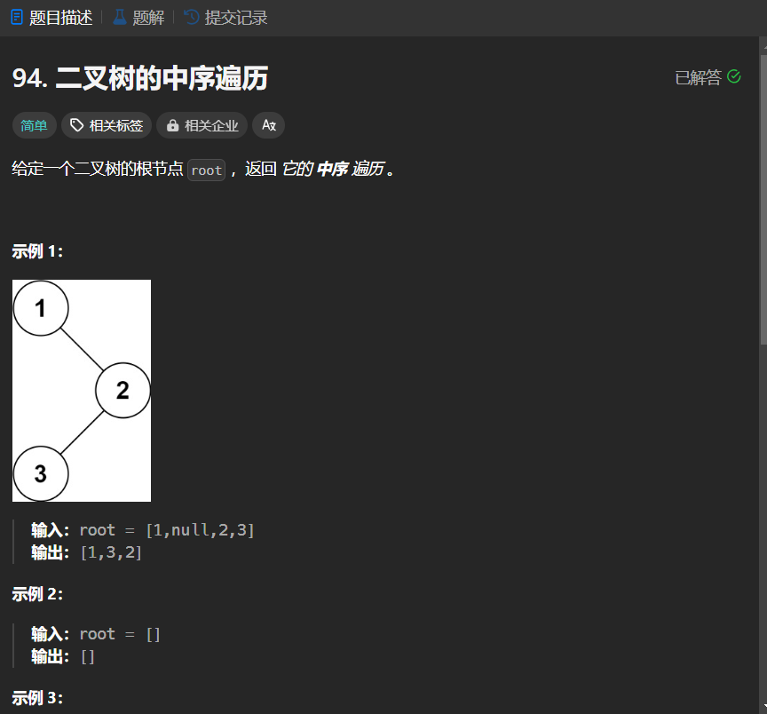

# 94. 二叉树的中序遍历
## 题目链接  
[94. 二叉树的中序遍历](https://leetcode.cn/problems/binary-tree-inorder-traversal/description/)
## 题目详情


***
## 解答一
答题者：EchoBai

### 题解
大家都懂得，用递归就行。

### 代码
``` cpp
/**
 * Definition for a binary tree node.
 * struct TreeNode {
 *     int val;
 *     TreeNode *left;
 *     TreeNode *right;
 *     TreeNode() : val(0), left(nullptr), right(nullptr) {}
 *     TreeNode(int x) : val(x), left(nullptr), right(nullptr) {}
 *     TreeNode(int x, TreeNode *left, TreeNode *right) : val(x), left(left), right(right) {}
 * };
 */
class Solution {
public:
    vector<int> inorderTraversal(TreeNode* root) {
        vector<int> res;
        if(root == nullptr)
            return res;
        inorder(root,res);
        return res;
    }
    void inorder(TreeNode *root, vector<int> &res){
        if(!root) return;
        if(root){
            inorder(root->left,res);
            res.push_back(root->val);
            inorder(root->right,res);
        }
    }
};
```


