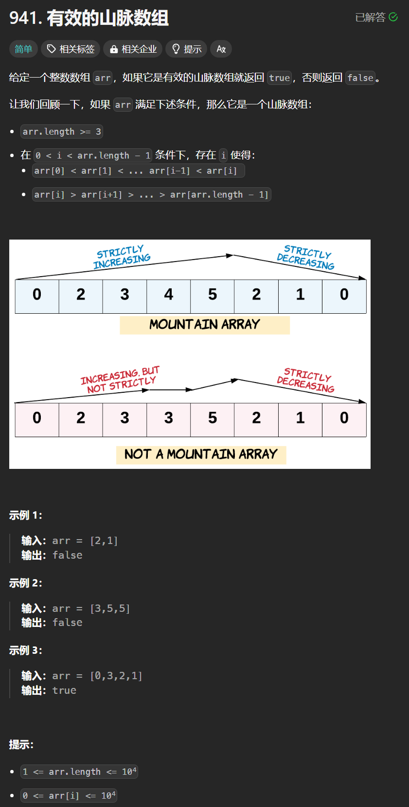

# 941. 有效的山脉数组
## 题目链接  
[941. 有效的山脉数组](https://leetcode.cn/problems/valid-mountain-array/)
## 题目详情


***
## 解答一
答题者：**Yuiko630**

### 题解
>双指针，中间相遇即true，否则false，注意题目说了长度小于3的直接false。

### 代码
``` Java
class Solution {
    public boolean validMountainArray(int[] arr) {
        int left = 0;
        int right = arr.length - 1;
        if(right < 2) return false;
        while(left + 1 < arr.length && arr[left + 1] > arr[left]){
            left++;
        }
        while(right - 1 >= 0 && arr[right - 1] > arr[right])
        {
            right--;
        }
        if(right == left && left != 0 && right != arr.length - 1) return true;
        return false;
    }
}
```