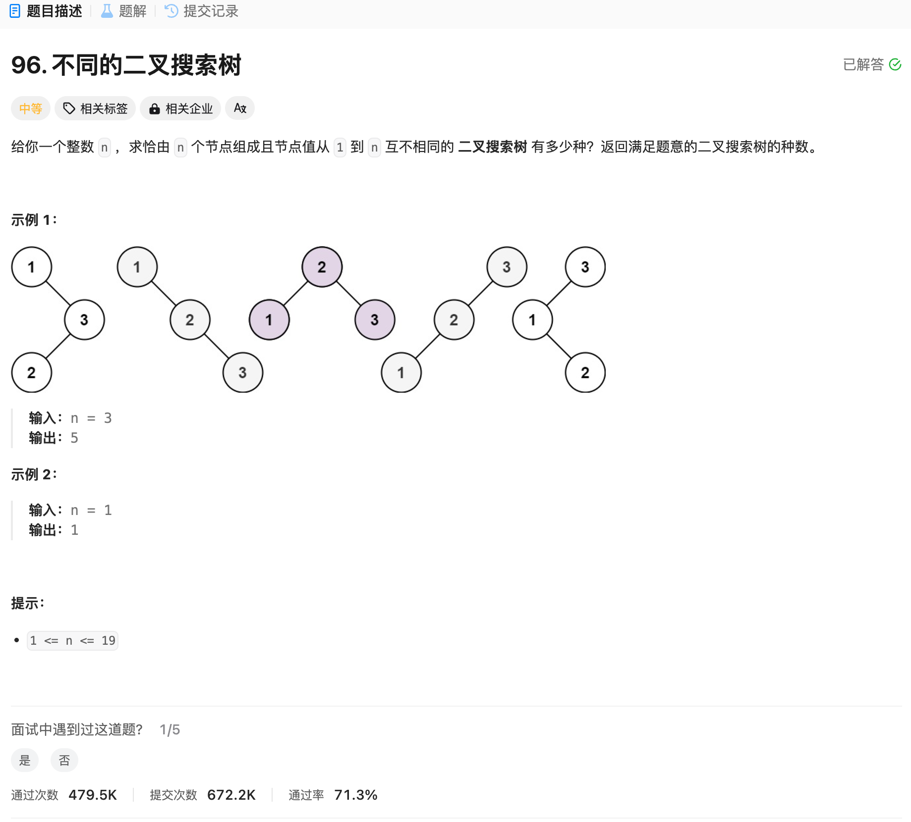

# 96. 不同的二叉搜索树
## 题目链接  
[96. 不同的二叉搜索树](https://leetcode.cn/problems/unique-binary-search-trees/description/)
## 题目详情


***
## 解答一
答题者：EchoBai

### 题解
卡特兰树，使用递推公式递推即可。

### 代码
``` cpp
class Solution {
public:
    int numTrees(int n) {
        
        long long res = 1;
        for(int i = 0; i < n; ++i){
            res = res * (2 * (2 * i + 1)) / (i + 2);
        }
        return res;
        
    }
};
```

## 解答二
答题者：**Yuiko630**

### 题解
>DP，i个节点的BST数量=从1到i分别为头节点的BST数量之和、即dp[i] += dp[j-1]*dp[i-j]。

### 代码
``` Java
class Solution {
    public int numTrees(int n) {
        int[] dp = new int[n+1];
        dp[0] = 1;
        for(int i = 1; i <= n; i++){
            for(int j = 1; j <= i; j++){
                dp[i] += dp[j-1]*dp[i-j];
            }
        }
        return dp[n];
    }
}
```