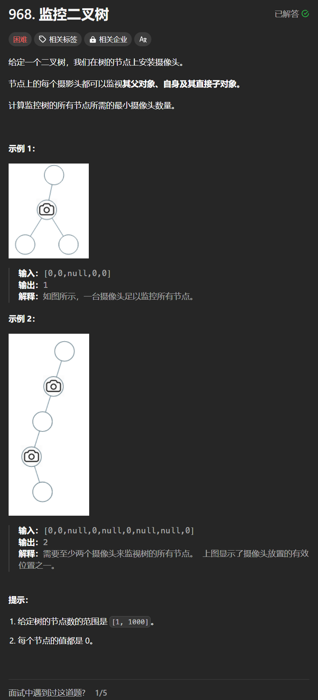

# 968. 监控二叉树
## 题目链接  
[968. 监控二叉树](https://leetcode.cn/problems/binary-tree-cameras/)
## 题目详情


***
## 解答一
答题者：**Yuiko630**

### 题解
>递归后续遍历时，让叶子节点的父节点安装摄像头，再隔2个节点再放。0表示无覆盖，1表示有摄像头，2表示有覆盖。当左右孩子有1个无覆盖时需要放置摄像头返回1，左右孩子都有覆盖时返回0，左右孩子至少有1个摄像头时返回2，空节点默认为有覆盖的，最后需要判断根节点是否有覆盖。

### 代码
``` Java
/**
 * Definition for a binary tree node.
 * public class TreeNode {
 *     int val;
 *     TreeNode left;
 *     TreeNode right;
 *     TreeNode() {}
 *     TreeNode(int val) { this.val = val; }
 *     TreeNode(int val, TreeNode left, TreeNode right) {
 *         this.val = val;
 *         this.left = left;
 *         this.right = right;
 *     }
 * }
 */
class Solution {
    public int result;
    public int traverse(TreeNode root){
        if(root == null) return 2;
        int left = traverse(root.left);
        int right = traverse(root.right);
        if(left == 2 && right == 2) return 0;
        else if(left == 0 || right == 0) {
            result++;
            return 1;
        }
        else if(left == 1 || right == 1) return 2;
        return -1;
    }
    public int minCameraCover(TreeNode root) {
        result = 0;
        if(traverse(root) == 0) result++;
        return result;
    }
}
```