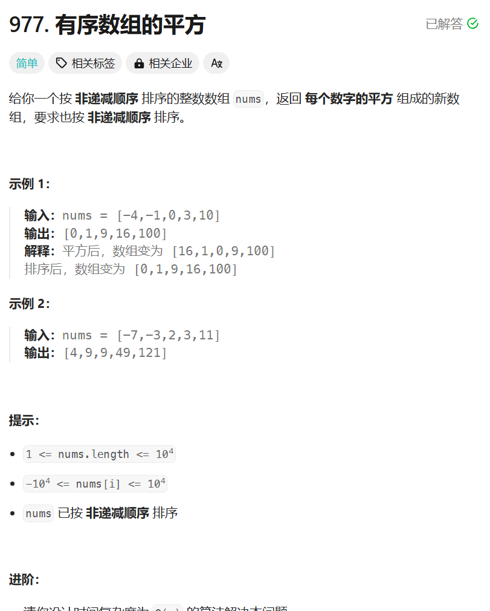

# 977. 有序数组的平方
## 题目链接  
[977. 有序数组的平方](https://leetcode.cn/problems/squares-of-a-sorted-array/description/)
## 题目详情


***
## 解答一
答题者：**Yuiko630**

### 题解
>双指针，归并的思想，先找到正负边界，平方后左边界递减，右边界递增，从边界往左右开始比较大小。

### 代码
``` Java
class Solution {
    public int[] sortedSquares(int[] nums) {
        int length = nums.length;
        int border = -1;
        for(int i = 0; i < length; i++){
            if(nums[i] < 0) border = i;
            else break;
        }
        int[] ans = new int[length];
        int index = 0;
        int i = border+1;
        int j = border;
        while(i < length || j >= 0){
            if(j < 0){
                ans[index++] = nums[i] * nums[i];
                i++;
            }
            else if(i >= length){
                ans[index++] = nums[j] * nums[j];
                j--;
            }
            else if(nums[i] * nums[i] < nums[j] * nums[j]){
                ans[index++] = nums[i] * nums[i];
                i++;
            }
            else {
                ans[index++] = nums[j] * nums[j];
                j--;
            }
        }
        return ans;
    }
}
```


