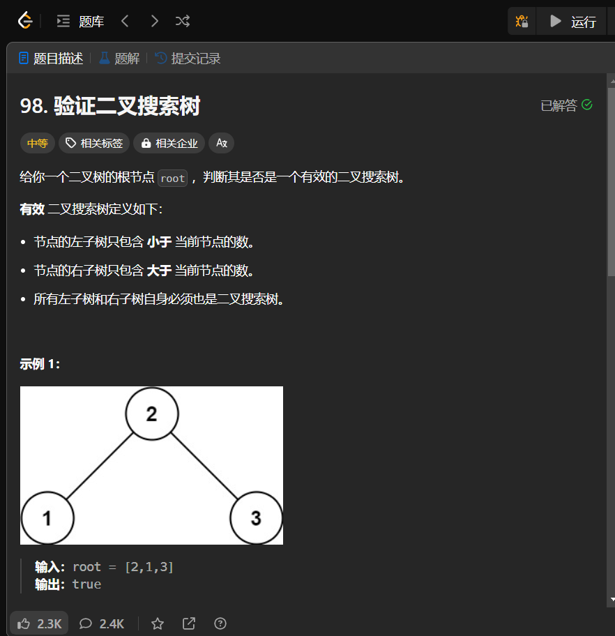

# 98. 验证二叉搜索树
## 题目链接  
[98. 验证二叉搜索树](https://leetcode.cn/problems/validate-binary-search-tree/description/)
## 题目详情


***
## 解答一
答题者：EchoBai

### 题解
二叉搜索数的中序遍历严格递增，先遍历然后顺序检索一遍即可。
### 代码
``` cpp
/**
 * Definition for a binary tree node.
 * struct TreeNode {
 *     int val;
 *     TreeNode *left;
 *     TreeNode *right;
 *     TreeNode() : val(0), left(nullptr), right(nullptr) {}
 *     TreeNode(int x) : val(x), left(nullptr), right(nullptr) {}
 *     TreeNode(int x, TreeNode *left, TreeNode *right) : val(x), left(left), right(right) {}
 * };
 */
class Solution {
public:
    bool isValidBST(TreeNode* root) {
        vector<int> res;
        inorder(root,res);
        for(int i = 1; i < res.size(); ++i){
            if(res[i-1] >= res[i]){
                return false;
            }
        }
        return true;
    }
    void inorder(TreeNode* root, vector<int> &res){
        if(!root) return;
        inorder(root->left,res);
        res.push_back(root->val);
        inorder(root->right,res);
    }
};
```

## 解答二
答题者：**Yuiko630**

### 题解
>记录一个最大值，递归中序遍历，看每次遇到的节点值是否比这个值更大即可。

### 代码
``` Java
/**
 * Definition for a binary tree node.
 * public class TreeNode {
 *     int val;
 *     TreeNode left;
 *     TreeNode right;
 *     TreeNode() {}
 *     TreeNode(int val) { this.val = val; }
 *     TreeNode(int val, TreeNode left, TreeNode right) {
 *         this.val = val;
 *         this.left = left;
 *         this.right = right;
 *     }
 * }
 */
class Solution {
    long max_val = Long.MIN_VALUE;
    public boolean isValidBST(TreeNode root) {
        if(root == null) return true;
        boolean left = isValidBST(root.left);
        if(root.val > max_val) max_val = root.val;
        else return false;
        boolean right = isValidBST(root.right);
        return left && right;
    }
}
```
