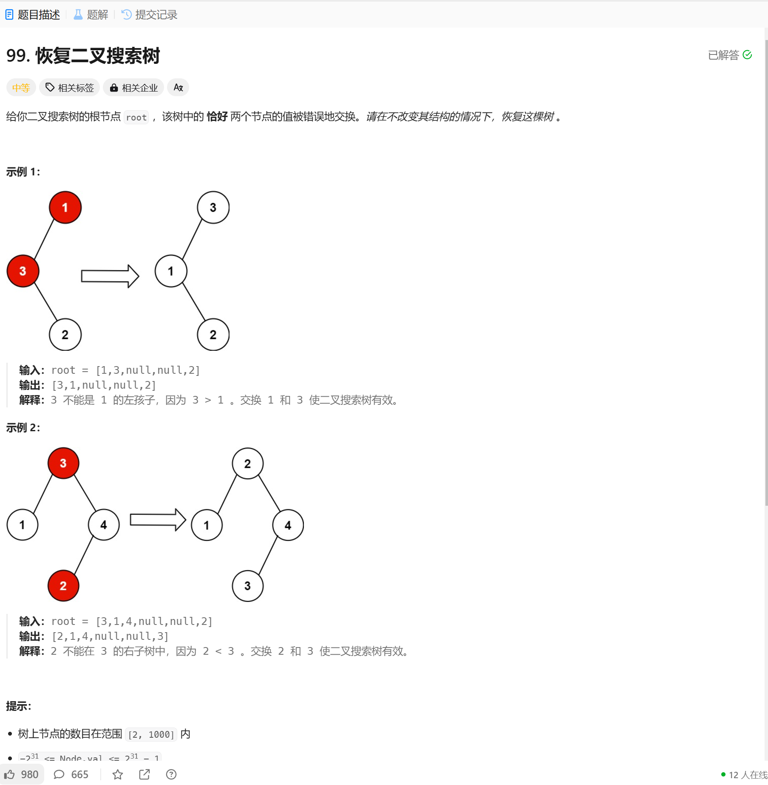

# 99. 恢复二叉搜索树
## 题目链接  
[99. 恢复二叉搜索树](https://leetcode.cn/problems/decode-ways/description/)
## 题目详情


***
## 解答一
答题者：**EchoBai**

## 题解
>两种方法，第一种遍历二叉搜素树得到每个节点和其对应的值，然后排序，将未排序和排序后的进行对比找出两个互换后的节点，交换值即可。第二种直接在遍历二叉树时找到递减的地方将对应节点值进行存储最后交换即可，不用额外的存储空间。

### 代码
``` c++
/**
 * Definition for a binary tree node.
 * struct TreeNode {
 *     int val;
 *     TreeNode *left;
 *     TreeNode *right;
 *     TreeNode() : val(0), left(nullptr), right(nullptr) {}
 *     TreeNode(int x) : val(x), left(nullptr), right(nullptr) {}
 *     TreeNode(int x, TreeNode *left, TreeNode *right) : val(x), left(left), right(right) {}
 * };
 */
class Solution {
public:
    void recoverTree(TreeNode* root) {
        vector<std::pair<TreeNode*,int>> vt;
        travel(root,vt);
        vector<std::pair<TreeNode*,int>> tmp = vt;
        sort(tmp.begin(), tmp.end(), [](const std::pair<TreeNode*, int>& a, const std::pair<TreeNode*, int>& b) {
            return a.second < b.second; // 按照第二个元素升序排序
        });
        TreeNode* first = nullptr;
        TreeNode* second = nullptr;
        int cnt = 1;
        for(int i = 0; i < vt.size(); ++i){
            if(vt[i].second != tmp[i].second){
                if(cnt == 1){
                    first = vt[i].first;
                    ++cnt;
                }else{
                    second = vt[i].first;
                }
            }
        }
        swap(first->val, second->val);
    }

    void travel(TreeNode* root, vector<std::pair<TreeNode*,int>>& vt){
        if(!root) return;
        travel(root->left, vt);
        vt.push_back({root, root->val});  
        travel(root->right,vt);
    }
};
```

```c++
class Solution {
public:
    void recoverTree(TreeNode* root) {
        TreeNode* first = nullptr;
        TreeNode* second = nullptr;
        TreeNode* prev = nullptr;

        inorder(root, &first, &second, &prev);

        if (second) swap(first->val, second->val);
    }

private:
    void inorder(TreeNode* root, TreeNode** first, TreeNode** second, TreeNode** prev) {
        if (!root) return;
        inorder(root->left, first, second, prev);
        if (*prev && (*prev)->val > root->val) {
            if (!*first) *first = *prev;
            *second = root;
        }
        *prev = root;
        inorder(root->right, first, second, prev);
    }
};
```
