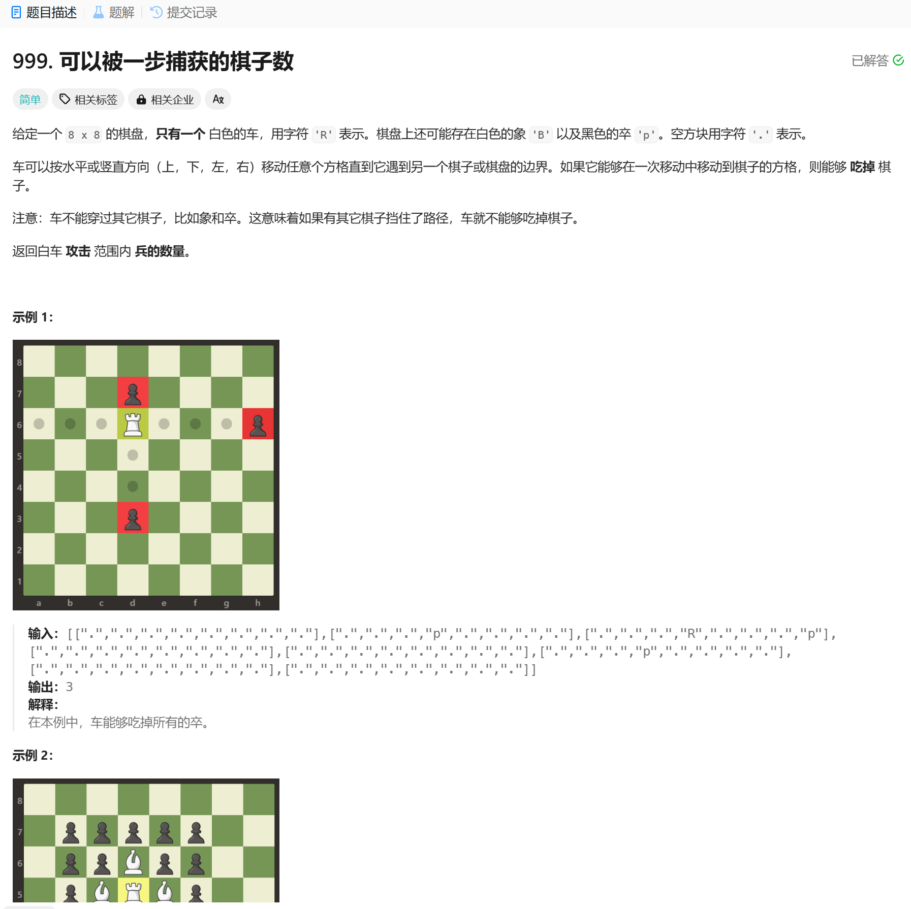

# 999. 可以被一步捕获的棋子数
## 题目链接  
[999. 可以被一步捕获的棋子数](https://leetcode.cn/problems/available-captures-for-rook/description/?envType=daily-question&envId=2024-12-06)
## 题目详情


***
## 解答一
答题者：EchoBai

### 题解
直接按题意模拟四个方向即可，如果是.那就一直向前走，跳出循环如果是p则计数++。

### 代码
``` cpp
class Solution {
    static constexpr int DIRS[4][2] = {{0, -1}, {0, 1}, {-1, 0}, {1, 0}};
public:
    int numRookCaptures(vector<vector<char>>& board) {
        int res = 0;
        int size = board.size();
        int x0 = 0, y0 = 0;
        for(int i = 0; i < board.size(); ++i){
            for(int j = 0; j < board[i].size(); ++j){
                if(board[i][j] == 'R'){
                    x0 = i;
                    y0 = j;
                    break;
                }
            }
        }

        for(auto& [dx, dy] : DIRS){
            int x = x0 + dx;
            int y = y0 + dy;

            while(0 <= x && x < size && 0 <= y && y < size && board[x][y] == '.'){
                x += dx;
                y += dy;
            }

            if(0 <= x && x < size && 0 <= y && y < size && board[x][y] == 'p'){
                ++res;
            }
        }
        return res;
    }
};
```
