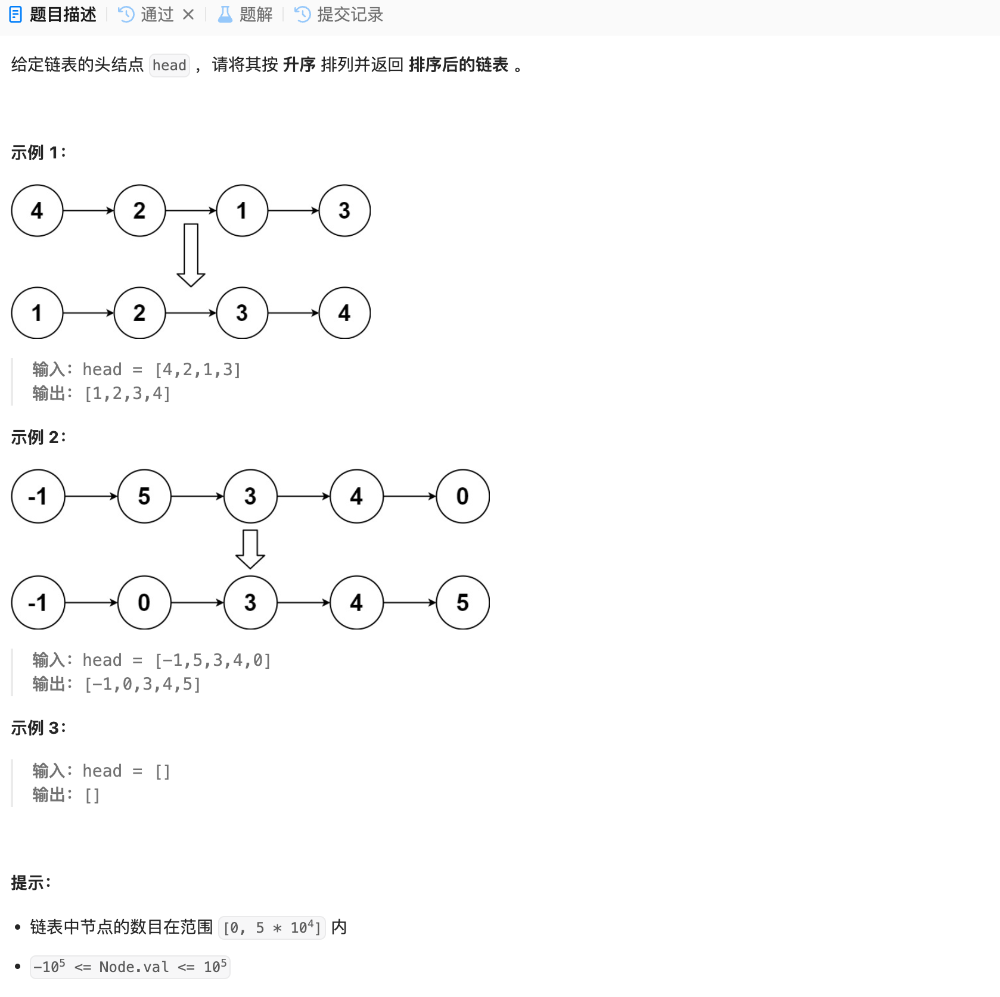

# LCR 077. 排序链表
## 题目链接  
[LCR 077. 排序链表](https://leetcode.cn/problems/7WHec2/description/)
## 题目详情


***
## 解答一
答题者：EchoBai

### 题解
将元素放到vector，然后sort排序，最后重组。

### 代码
``` cpp
/**
 * Definition for singly-linked list.
 * struct ListNode {
 *     int val;
 *     ListNode *next;
 *     ListNode() : val(0), next(nullptr) {}
 *     ListNode(int x) : val(x), next(nullptr) {}
 *     ListNode(int x, ListNode *next) : val(x), next(next) {}
 * };
 */
class Solution {
public:
    ListNode* sortList(ListNode* head) {
        if(!head || !head->next) return head;
        ListNode* ret = new ListNode(-1);
        ListNode* tmp = head;
        head = ret;

        std::vector<int> st;
        while(tmp){
            st.emplace_back(tmp->val);
            tmp = tmp->next;
        }

        sort(st.begin(),st.end());

        for(auto e : st){
            ListNode* p = new ListNode(e);
            p->next = nullptr;
            ret->next = p;
            ret = ret->next;
        }
        return head->next;

    }

};
```
