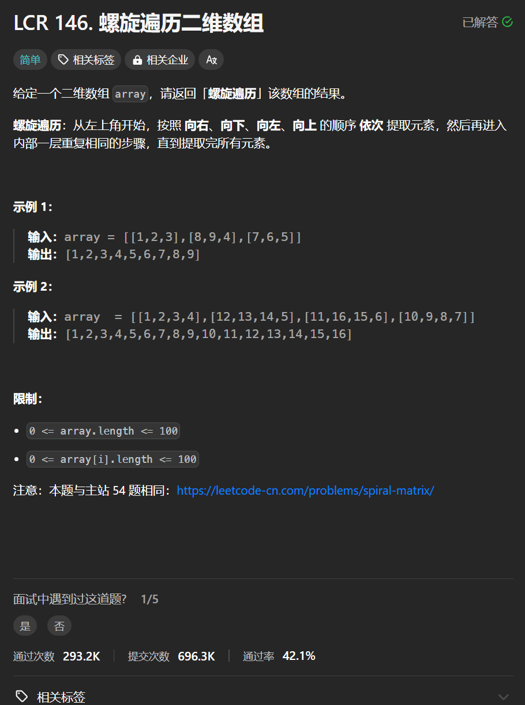

# LCR 146. 螺旋遍历二维数组
## 题目链接  
[LCR 146. 螺旋遍历二维数组](https://leetcode.cn/problems/shun-shi-zhen-da-yin-ju-zhen-lcof/description/)
## 题目详情


***
## 解答一
答题者：**Yuiko630**

### 题解
>填充上行从左到右left->right，填充右列从上到下top+1->bottom，填充下行从右到左right-1->left-1，填充左列从下到上bottom->top-1。

### 代码
``` Java
class Solution {
    public int[] spiralArray(int[][] array) {
        if(array.length == 0) return new int[0];
        int m = array.length;
        int n = array[0].length;
        int[] result = new int[m * n];
        int left = 0, top = 0, right = n-1, bottom = m-1;
        int index = 0;
        while(top <= bottom && left <= right){
            for(int j = left; j <= right; j++){
                result[index++] = array[top][j];
            }
            for(int i = top+1; i <= bottom; i++){
                result[index++] = array[i][right];
            }
            if(top < bottom && left < right){
                for(int j = right-1; j > left; j--){
                    result[index++] = array[bottom][j];
                }
                for(int i = bottom; i > top; i--){
                    result[index++] = array[i][left];
                }
            }
            top++;
            left++;
            bottom--;
            right--;
        }
        return result;
    }
}
```