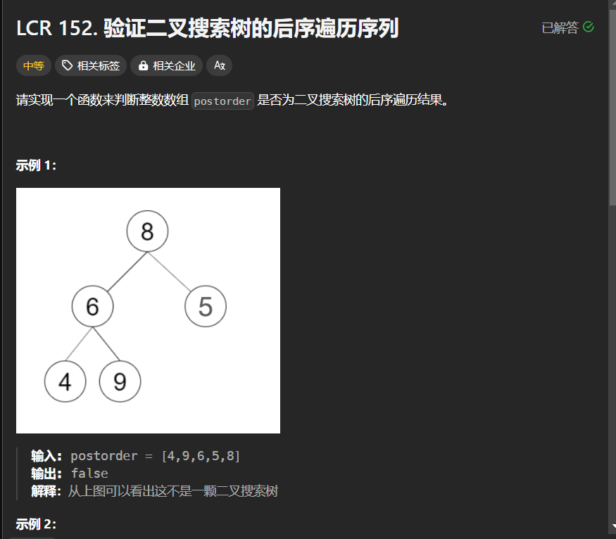

# LCR 152. 验证二叉搜索树的后序遍历序列
## 题目链接  
[LCR 152. 验证二叉搜索树的后序遍历序列](https://leetcode.cn/problems/er-cha-sou-suo-shu-de-hou-xu-bian-li-xu-lie-lcof/description/)
## 题目详情


***
## 解答一
答题者：EchoBai

### 题解
单调栈的思想，将后序遍历结果逆序之后就为`根，右，左`的排序，根据规律，该序列中若`arr[i] < arr[i + 1]`，则`arr[i + 1]`为`arr[i]`的右子节点，若`arr[i] > arr[i + 1]`，则`arr[i+1]`为`arr[0]...arr[i]`中某个节点的左子节点，并且这个值是大于`arr[i+1]`中最小的。如此我们使用栈来实现，从后往前遍历，如果栈顶一直小于当前元素，则一直入栈，直到出现小于栈顶的元素，则根据上面的规律一直出栈并不断更新`parent`找到其父节点，而当前值一定是小于父节点的，所以如果当前值比父节点大，那么直接返回`false`即可。

### 代码
``` cpp
class Solution {
public:
    bool verifyTreeOrder(vector<int>& postorder) {
        stack<int> s;
        int parent = INT_MAX;
        for(int i = postorder.size() - 1; i >= 0; --i){
            while(!s.empty() && s.top() > postorder[i]){
                parent = s.top();
                s.pop();
            }
            if(postorder[i] > parent)
                return false;
            s.push(postorder[i]);
        }
        return true;

    }
   
};
```


