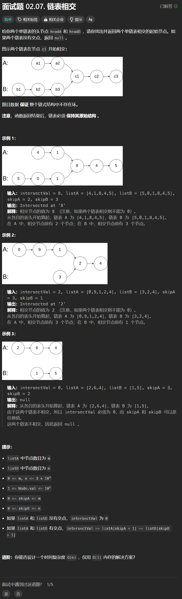

# 面试题02. 07. 链表相交
## 题目链接  
[面试题02. 07. 链表相交](https://leetcode.cn/problems/intersection-of-two-linked-lists-lcci/)
## 题目详情


***
## 解答一
答题者：**Yuiko630**

### 题解
> 将两个链表拼接后长度一致，遍历找相同
### 代码
``` Java
/**
 * Definition for singly-linked list.
 * public class ListNode {
 *     int val;
 *     ListNode next;
 *     ListNode(int x) {
 *         val = x;
 *         next = null;
 *     }
 * }
 */
public class Solution {
    public ListNode getIntersectionNode(ListNode headA, ListNode headB) {
        if(headA == null || headB == null) return null;
        ListNode pA = headA;
        ListNode pB = headB;
        while(pA != pB){
            pA = pA == null? headB: pA.next;
            pB = pB == null? headA: pB.next;
        }
        return pA;
    }
}
```