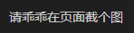

# Leetcode
## 简介
刷leetcode题目记录


请在提交前先进行(最好在添加前执行)
```bash
git pull origin main
```

### 添加文件以markdown文件进行添加
文件命名为：`[题目编号] + ". " + [题目名称] + ".md"`
- 例子: `1. 两数之和.md`
# 增加题目的markdown模板：

# 题目编号 + 题目名称
## 题目链接
[题目名称](https://leetcode.cn/)
## 题目详情


***
## 解答一
答题者：**TEST**
### 题解
> 请写出你的思路
### 代码
``` [用什么语言]
放代码
```